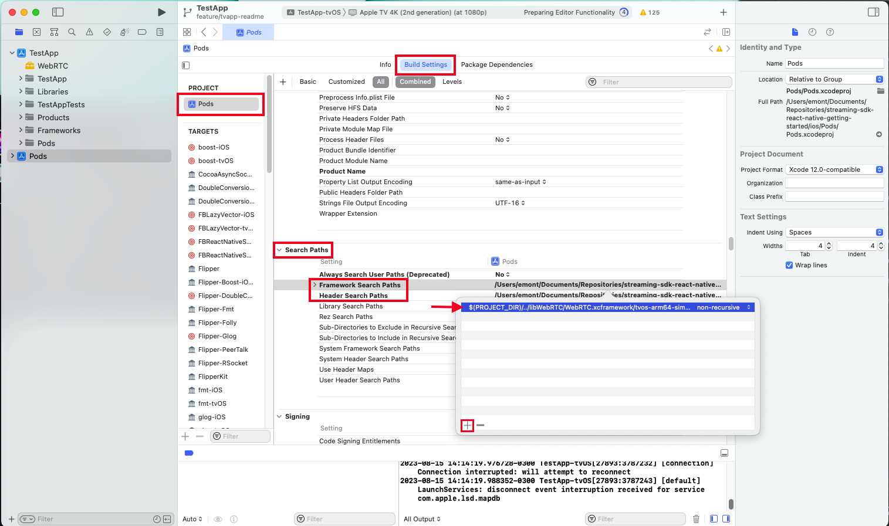
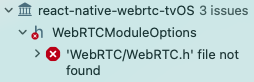

# React Native TV Sample App

In this document we describe how to run the application on mobile (Android and iOS) and TV (Android and tvOS) on emulators.

## How to run the app
### Apple

The following steps are common for all Apple devices.

1. Clone this repository and check out to `tvapp` branch.
2. Install the dependencies:
```
yarn
```
3. Then, execute:
```
cd ios && pod install
```

Create an `.env` inside the root folder with the following credentials:

```
MILLICAST_STREAM_NAME=
MILLICAST_ACCOUNT_ID=
MILLICAST_PUBLISHING_TOKEN=
```

5. Download WebRTC M112 build from https://dolby.box.com/s/dh6hww4ksvnju768kbsu7guuxrc3ot2k
6. Unzip libWebRTC and move it inside the `ios` folder from this project.
#### iOS

1. Open Xcode.
2. Select `Open a project from a file` and then select `/streaming-sdk-react-native-getting-started/ios/TestApp.xcworkspace`.
3. Select `TestApp project`, then `TestApp` target.
4. Go to `General -> Frameworks, Libraries, and Embedded Content` and add `WebRTC.framework` M112 build for iOS.
Check if the framework appears in `Build Phases -> Embed Frameworks` on `Link Binary With Libraries`, if not, add it.
1. Then select `Pods` Xcode project and go to `Build Settings -> Search Paths`.

- In `Frameworks Search Paths`, insert the following line: 
```
$(PROJECT_DIR)/../libWebRTC/WebRTC.xcframework/ios-arm64
$(PROJECT_DIR)/../libWebRTC/WebRTC.xcframework/ios-arm64_x86_64-simulator
```

<!-- - In `Header Search Paths`, insert the following lines: 
```
$(PROJECT_DIR)/../libWebRTC/WebRTC.xcframework/ios-arm64/WebRTC.framework/Headers
$(PROJECT_DIR)/../libWebRTC/WebRTC.xcframework/ios-arm64_x86_64-simulator/WebRTC.framework/Headers
``` -->

1. Select `TestApp` project and use an iOS simulator with iOS 16.

2. Run the project, you should see the simulator with the app home page with a buttom to subscribe to a stream.

#### tvOS

<!-- - It is required to have `WebRTC.framework` M112 build for tvOS. Place your build directory inside the `ios` folder. -->

##### Xcode settings

1. Open Xcode.
1. Select `Open a project from a file` and then select `/streaming-sdk-react-native-getting-started/ios/TestApp.xcworkspace`.
1. Select `TestApp project`, then `TestApp-tvOS` target.
1. Go to `General -> Frameworks, Libraries, and Embedded Content` and add `WebRTC.framework` M112 build for tvOS.
Also, add the framework in `Build Phases -> Embed Frameworks` and on `Link Binary With Libraries`.
1. Then select `Pods` Xcode project and go to `Build Settings -> Search Paths`.



- In `Frameworks Search Paths`, insert the following line: 
```
$(PROJECT_DIR)/../libWebRTC/WebRTC.xcframework/ios-arm64_x86_64-simulator
$(PROJECT_DIR)/../libWebRTC/WebRTC.xcframework/tvos-arm64-simulator
```

<!-- - In `Header Search Paths`, insert the following lines: 
```
$(PROJECT_DIR)/../libWebRTC/WebRTC.xcframework/tvos-arm64/WebRTC.framework/Headers
$(PROJECT_DIR)/../libWebRTC/WebRTC.xcframework/tvos-arm64-simulator/WebRTC.framework/Headers
``` -->

1. Select `TestApp-tvOS` project and use a tvOS simulator with tvOS 16.

2. Run the project, you should see the simulator with the app home page with a buttom to subscribe to a stream.


### Android

The following steps are common for all Android devices.

1. Clone this repository and move to `tvapp` branch.
2. To install dependencies, run:
```
yarn
```
1. Inside `android` directory, create a file called `local.properties` which only content should be the path of the Java SDK directory, this should look like:
```
sdk.dir = /../Android/sdk
```
This varies from OS to OS, so make sure to put the right path.

1. If you want to run it on an emulator, make sure to have installed one on Android Studio. To do this go to: `Android Studio -> More Actions -> Virtual Device Manager -> Create device`. In case you want to run it on an real android device, just plug it in through USB. Make you sure you have already upgraded the device to 'developer mode'.

2. Open and run the simulator and then execute the application from the terminal:
```
yarn run android
```

You should have an Android TV/mobile simulator on Android Studio.

## Supported platforms

The application in meant to run on mobile (Android and iOS) and TV (Android and tvOS).

So far, we have tested the app on the following emulators, having good results in all of them:

- **Android TV:** Android TV (1080p) API 33 Tiramisu
- **Android mobile:** Pixel 6 Pro API 33 Tiramisu
- **Apple TV:** Apple TV 4K (3rd generation) (at 1080p)
- **Apple mobile:** iPhone 13 Pro Max

## Known issues

- It's known that the application may crash from time to time for unknown reasons.
- For obvious reasons, the 'Publisher' will not work on TV but it does on mobile.

## Trupleshooting

If you have the following error message on Xcode:



