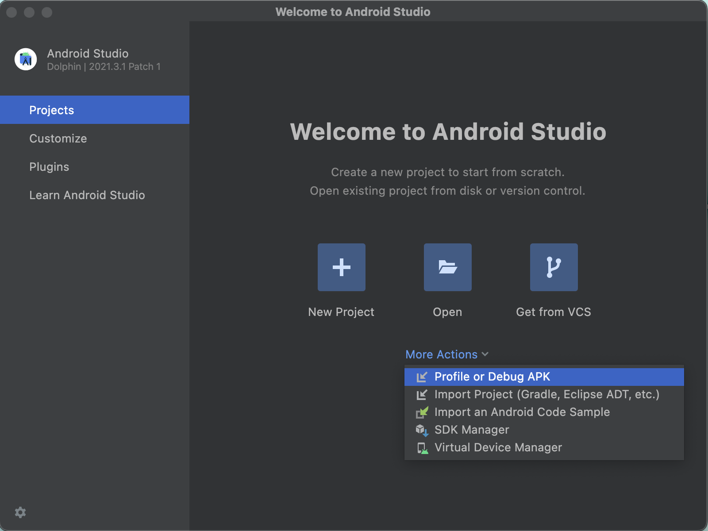

## Table of Contents

- [Millicast React Native Sample App](#millicast-react-native-sample-app)
  - [Add Your Credentials](#add-your-credentials)
  - [Connecting a Device](#connecting-a-real-device)
  - [Setting Up the Project in Android](#setting-up-the-project-in-android)
    - [Setting Up an Emulator with Android Studio](#setting-up-an-emulator-with-android-studio)
    - [Setting Up the Camera](#setting-up-the-camera)
    - [Setting Up the Microphone](#setting-up-the-microphone)
  - [Setting up Emulator for iOS](#setting-up-emulator-for-ios)
  - [Usage](#usage)
  - [Publisher App](#publisher-app)
    - [Publisher Settings](#publisher-settings)
  - [Subscriber App](#subscriber-app)
  - [Troubleshooting](#troubleshooting)

# Millicast React Native Sample App

This is a sample app that showcases the integration between the Millicast SDK for JavaScript and React Native.

## Add Your Credentials

Add a `.env` file in the current path. You can find the following example in `.env.sample` file:

```
MILLICAST_STREAM_NAME=yourStreamName
MILLICAST_ACCOUNT_ID=yourAccountId
MILLICAST_PUBLISHING_TOKEN=yourPublishingToken
```

You will need to find or create a new stream name with a token in your Dolby.io dashboard. You can do that following this [link](https://docs.dolby.io/streaming-apis/docs/managing-your-tokens).

You need to set up an emulator or connect a device in order to run the app.

## Connecting a Device

For **Android**:

1. Put your Android device in debug mode by following this [tutorial](https://developer.android.com/studio/debug/dev-options).
2. Connect the device to your PC.
3. Using your specific IDE, run the app in the detected device.

For **iOS**:

1. Plug in your iPhone, sign in with your iCloud account in XCode.
2. Change the device in your IDE.
4. Build and run the app in the detected device.


## Setting Up the Project in Android

In case you want to run the app on Android, be sure to create a file `/android/local.properties` with the following content:
```
sdk.dir = PATH_ANDROID_SDK
```
Where `PATH_ANDROID_SDK` should be replaced by your Android SDK path.


### Setting Up an Emulator with Android Studio

Following the guide above, you should already have your emulator up and running.

From the Android Studio welcome page:
1. Select the `More actions` drop-down menu.
2. Select `Virtual Device Manager`.

As shown in the image below:




Be sure to give access to your computer camera and microphone in order to be able to use it for testing, otherwise the emulator will create a sample video simulating the camera usage.

### Setting Up the Camera

To give your Android emulator access to your camera, go to Android Studio and edit your desired emulator.


### Setting Up the Microphone

To give your Android emulator access to your microphone, start your emulator and open the emulator options. Then enable `Virtual headset plug inserted` and `Virtual microphone uses host audio input`.


## Setting up Emulator for iOS

If you want to test the Publish feature in iOS you will need an actual Apple device, as the Apple emulator does not allow access to the camera.

## Usage

In order to run the example app, it is necessary to have Yarn installed. You can install Yarn by running the following command:

```
npm install --global yarn
```

Now you are ready to use Yarn in the command line.

To install all the required dependencies, run the following command:
```
yarn
```

To test the sample app once the `.env` file is set up, run the following command in the root folder:

```
yarn run
```

You will be prompted to launch the app on Android or iOS.

Once in the app you will be prompted with the home page allowing you to choose between the Publisher and Subscriber (Viewer) apps.


## Publisher App

In the **Publisher App**, you can play/pause, switch camera, mute/unmute and turn the camera on/off, allowing you to keep the viewer user count.


### Publisher Settings

Publisher settings allow you to set the codec (only before the streaming is started) and change the bitrate (only after the streaming is started). By default, the bitrate is set to the maximum possible.

## Subscriber App

In the **Subscriber App**, you can play/pause, mute/unmute, and have access to the multiview functionality.


## Troubleshooting

- The app may experiment some issues with Samsung phones.
- The H264 may not to reproduce correctly in either Android or iOS emulators.
