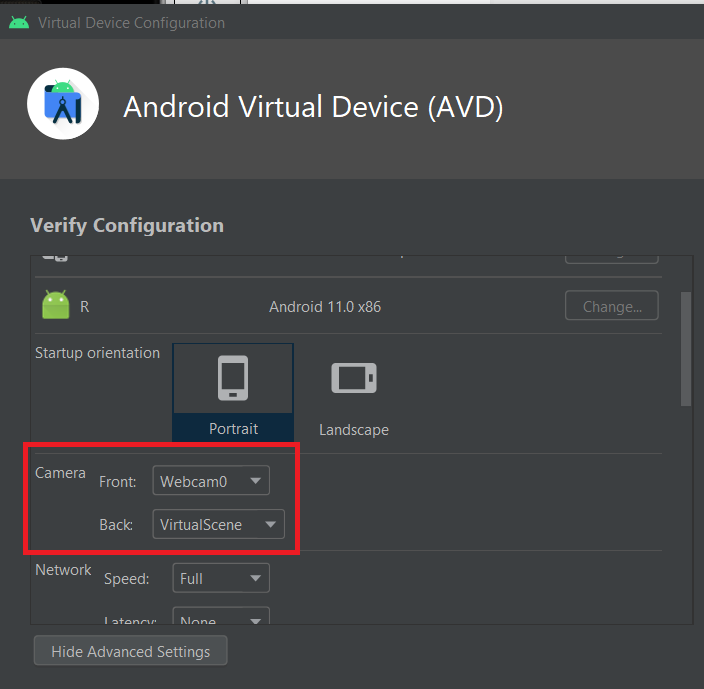
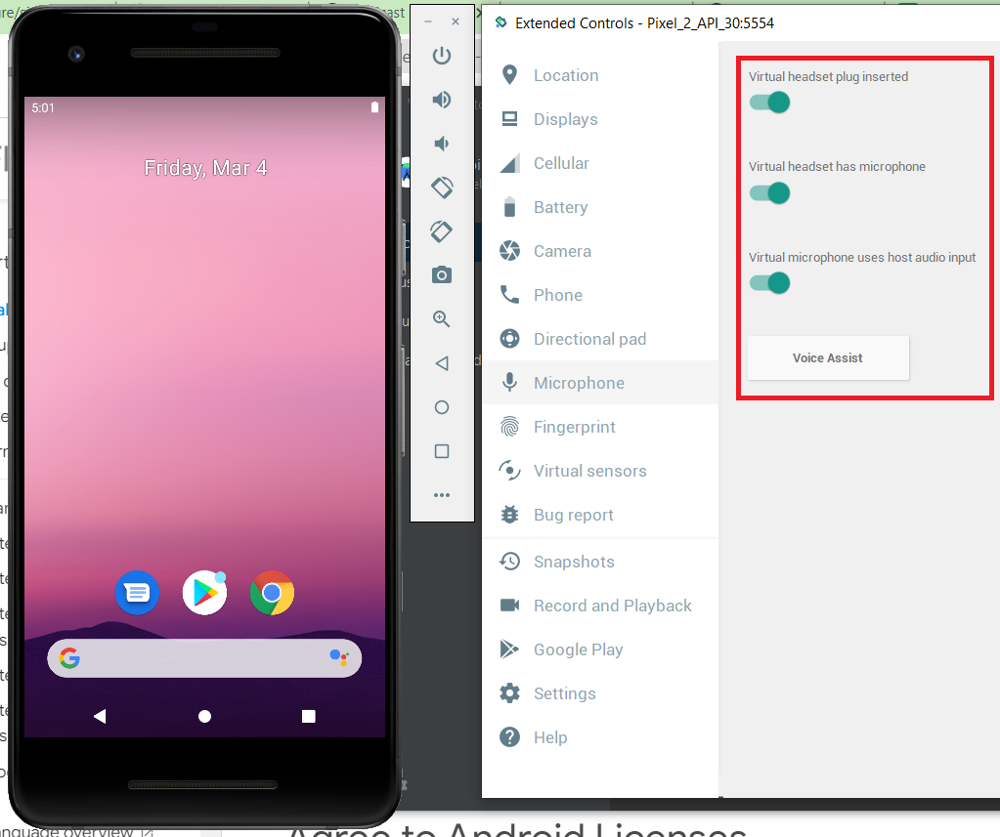
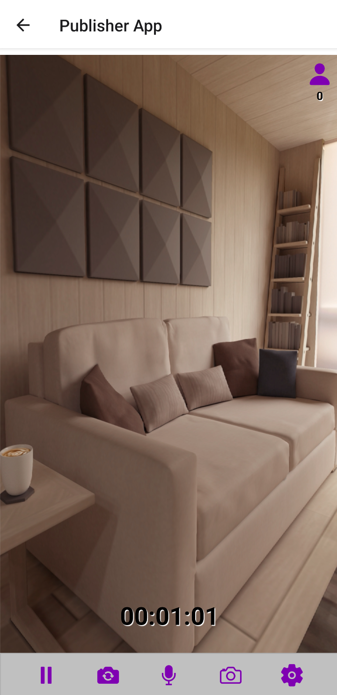
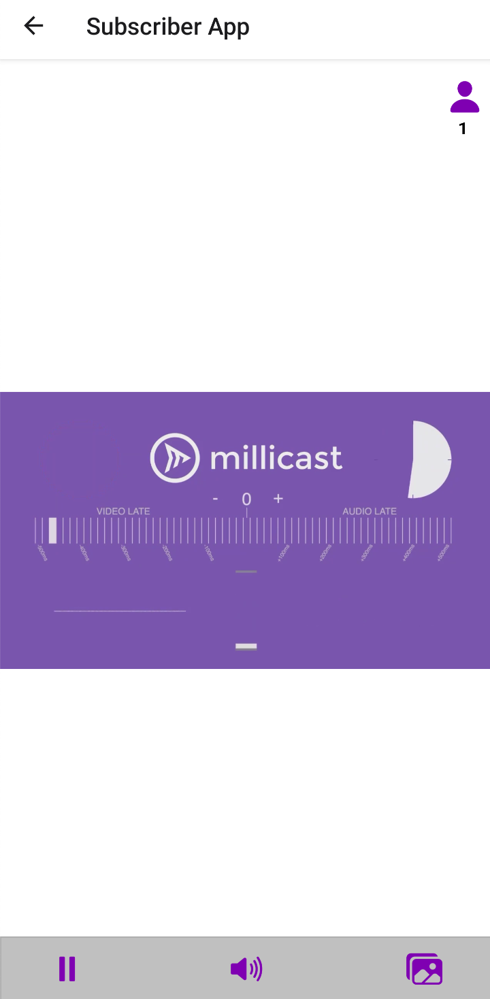

# Millicast React Native Example App

This is a sample app that showcases the integration between JS streaming SDK and React Native.

Add a `.env` file in current path. You can find the following example in `.env.sample` file:

```
MILLICAST_STREAM_NAME=yourStreamName
MILLICAST_ACCOUNT_ID=yourAccountId
MILLICAST_PUBLISHING_TOKEN=yourPublishingToken
```

You will need to find or create a new stream name with a token in your Millicast Dashboard. You can do that following this [link](https://docs.dolby.io/streaming-apis/docs/managing-your-tokens).

You need to set up an emulator or connect a device in order to run the app.

## Connect Real Device

For **Android**:

1. Put you Android device in debug mode following this [tutorial](https://developer.android.com/studio/debug/dev-options).
2. Connect device and using your specific IDE.
3. Run the app in the detected device.

### Setting Up Emulator with Android Studio

Following the guide indicated above, you should already have your emulator up and running.

Be sure to give access to your computer camera and microphone in order to be able to use it for testing, otherwise the emulator will create a sample video simulating the camera usage.

### Setting Up Camera

To give your Android emulator access to your camera, go to Android Studio and edit your desired emulator.



### Setting Up Microphone

To give your Android emulator access to your microphone, start you emulator and open the emulator options. Then enable `Virtual headset plug inserted` and `Virtual microphone uses host audio input`.



## Usage

For running the example app is necessary to have installed Yarn, you can do this by simple running this sentence in the command line:
```
npm install --global yarn
```

Now, you are ready to use Yarn in the command line.

To install all the required dependencies, run the following command:
```
yarn run
```


To test the example app once the `.env` file is set up, simply run the following command in root folder:

```
yarn run
```

In case of using Android, you can simply run:

```
yarn run android
```

Once in the app you will be prompted with the home page allowing you to choose between the Publisher and Subscriber (Viewer) apps.


## Publisher App

In the **Publisher app**, you can play/pause, switch camera, mute/unmute and turn on/off camera; allowing you to keep the viewer user count.



### Publisher Settings

Publisher settings allow you to set the codec (only before the streaming is started) and change the bitrate (only after the streaming is started). By default, the bitrate maximum possible.

## Subscriber App

In the **Subscriber app**, you can play/pause, mute/unmute and have access to the multiview functionality.



## Troubleshooting

It is known that the app may experiment some issues in Samsung phones.