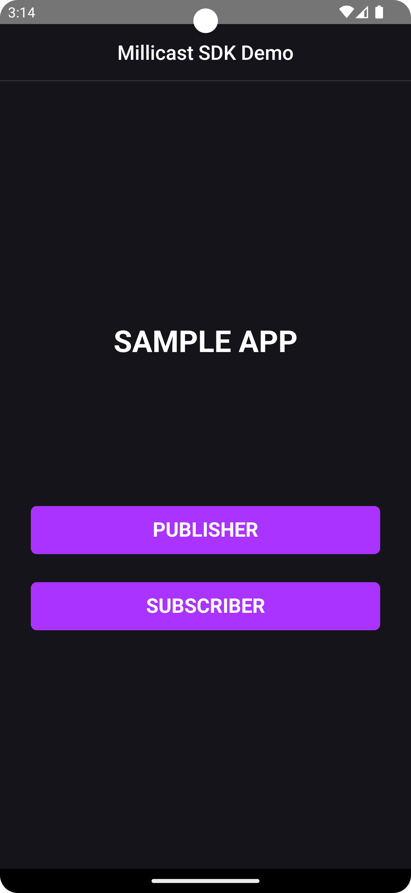
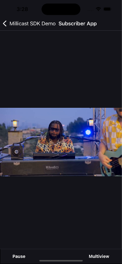
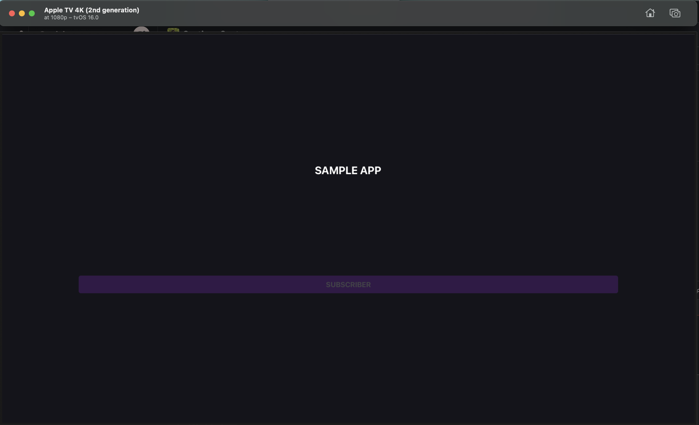
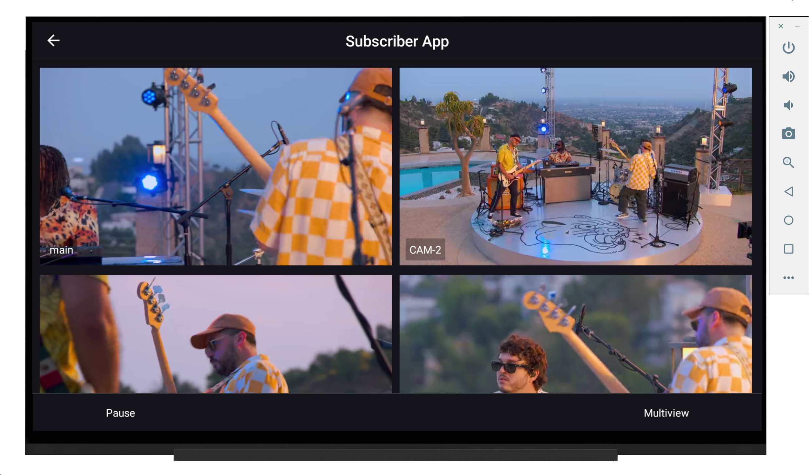
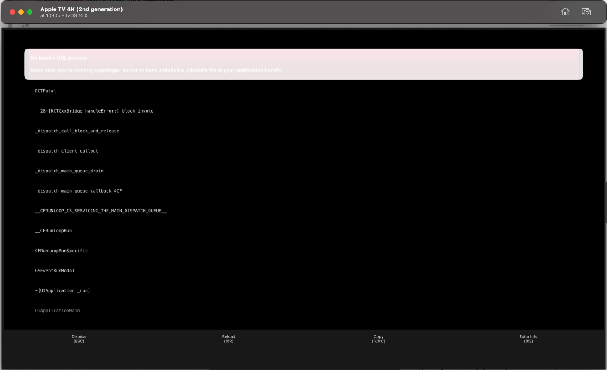

# React Native Sample App

<div style="display: flex; align-items: center; justify-content: center;">
    
    
    
    
</div>


## Overview
In this document we describe how to run a sample application for publishing and subscribing to a stream using Dolby credentials on mobile (Android and iOS) and TV (Android and tvOS) on emulators.

| Use Case | Publish | Subscribe | Multiview | Tech Stack| 
| -------- | -------- | --------- | --------- | --------- |
| Android mobile |   &#x2713; |  &#x2713; |  &#x2713; | Java 11 SDK, Android Studio, Android emulator.
| Android TV |   &#x2717; |  &#x2713; |  &#x2713; | Java 11 SDK, Android Studio, Android TV emulator.
| iPhone |   &#x2713; |  &#x2713; |  &#x2713; | Xcode, WebRTC build for iOS.
| tvOS |   &#x2717; |  &#x2713; |  &#x2713; | Xcode, WebRTC build for tvOS.


## Requirements and supported platforms

The application is meant to run on mobile (Android and iOS) and TV (Android and tvOS).

So far, we have tested the app on the following emulators, having good results in all of them:

- **Android TV:** Android TV (1080p) API 33 Tiramisu
- **Android mobile:** Pixel 6 Pro API 33 Tiramisu
- **Apple TV:** Apple TV 4K (3rd generation) (at 1080p) tvOS 16.0 and above
- **Apple mobile:** iPhone 13 Pro Max iOS 16.4
- **Xcode** version 14.3.1
- **Android Studio** Dolphin 2021.3.1 patch 1

### Environment Set Up

- We recommend using `yarn`, if you don't have it installed execute:
```
npm install --global yarn
```

- For **iOS** and **tvOS** Git Large File Storage is needed, install it with
```
brew install git-lfs
```


- For **Android** platforms you will need `Java SDK 11` and Android Studio installed.

- Add a `.env` file in current path. You can find the following example in `.env.sample`:
```sh
# Make a .env file with the following vars
MILLICAST_STREAM_NAME=yourStreamName
MILLICAST_ACCOUNT_ID=yourAccountId
MILLICAST_PUBLISH_TOKEN=yourPublishToken
```

## Getting Started

To get started with building this app, you will need a Dolby.io account.

### Pre-requisistes

- Dolby account.
- [Git LFS](https://docs.github.com/en/repositories/working-with-files/managing-large-files/installing-git-large-file-storage) installed.
- It is required to have Java SDK 11.
- Yarn installed
- Xcode 14
- Android Studio Dolphin
- iOS 16
- tvOS 16
- Android API 33

#### How to get a Dolby.io account
To setup your [Dolby.IO](https://dolby.io/) account, go to the [Dolby.IO](https://dolby.io/) dashboard and complete the form. After confirming your email address, you will be logged in.
If you did not receive a verification email, check your Spam or Junk email folders.

## How to build and run the React Native Sample App

### Apple

The following steps are common for all Apple devices.

1. Clone this repository.
2. Install the dependencies:
```
yarn
```
3. Then, execute:
```
cd ios && pod install
```

1. It is required to have `WebRTC.framework` M112 builds. You can find it in `ios/libWebRTC.zip`.

2. To download the zip file from Git LFS is needed to run the command `git lfs pull`.

3. Unzip `libWebRTC` inside the `ios` folder from this project.
#### iOS

1. Open Xcode.
2. Select `Open a project from a file` and then select `/streaming-sdk-react-native-getting-started/ios/TestApp.xcworkspace`.
3. Select `TestApp project`, then `TestApp` target.
4. Go to `General -> Frameworks, Libraries, and Embedded Content` and add `WebRTC.framework` M112 build for iOS.
Check if the framework appears in `Build Phases -> Embed Frameworks` on `Link Binary With Libraries`, if not, add it.
1. Then select `Pods` Xcode project and go to `Build Settings -> Search Paths`.

- In `Frameworks Search Paths`, insert the following line: 
```
$(PROJECT_DIR)/../libWebRTC/WebRTC.xcframework/ios-arm64
$(PROJECT_DIR)/../libWebRTC/WebRTC.xcframework/ios-arm64_x86_64-simulator
```

- In `Header Search Paths`, insert the following lines: 
```
$(PROJECT_DIR)/../libWebRTC/WebRTC.xcframework/ios-arm64/WebRTC.framework/Headers
$(PROJECT_DIR)/../libWebRTC/WebRTC.xcframework/ios-arm64_x86_64-simulator/WebRTC.framework/Headers
```

6. Select `TestApp` project and use an iOS simulator with iOS 16.

7. Run the project, you should see the simulator with the app home page with a button to publish or subscribe to a stream.

#### tvOS

##### Xcode settings

1. Open Xcode.
2. Select `Open a project from a file` and then select `/streaming-sdk-react-native-getting-started/ios/TestApp.xcworkspace`.
3. Select `TestApp project`, then `TestApp-tvOS` target.
4. Go to `General -> Frameworks, Libraries, and Embedded Content` and add `WebRTC.framework` M112 build for tvOS.
Also, add the framework in `Build Phases -> Embed Frameworks` and on `Link Binary With Libraries`.
5. Then select `Pods` Xcode project and go to `Build Settings -> Search Paths`.


- In `Frameworks Search Paths`, insert the following line: 
```
$(PROJECT_DIR)/../libWebRTC/WebRTC.xcframework/tvos-arm64_x86_64-simulator
$(PROJECT_DIR)/../libWebRTC/WebRTC.xcframework/tvos-arm64-simulator
```

- In `Header Search Paths`, insert the following lines: 
```
$(PROJECT_DIR)/../libWebRTC/WebRTC.xcframework/tvos-arm64/WebRTC.framework/Headers
$(PROJECT_DIR)/../libWebRTC/WebRTC.xcframework/tvos-arm64-simulator/WebRTC.framework/Headers
```

6. Select `TestApp-tvOS` project and use a tvOS simulator with tvOS 16.

7. Run the project, you should see the simulator with the app home page with a buttom to subscribe to a stream.

To navigate use the arrow keys and enter button. Also, on the Simulator window you can go to `Window -> Show Apple TV Remote` and use it.

### Android

The following steps are common for all Android devices.

1. Clone this repository.
2. To install dependencies, run:
```
yarn
```

1. Inside `android` directory, create a file called `local.properties` which only content should be the path of the Java SDK directory, this should look like:
```
sdk.dir = /../Android/sdk
```

This varies from OS to OS, so make sure to put the right path.

4. If you want to run it on an emulator, make sure to have installed one on Android Studio (mobile or TV). To do this go to: `Android Studio -> More Actions -> Virtual Device Manager -> Create device`. In case you want to run it on an real android device, just plug it in through USB. Make you sure you have already upgraded the device to 'developer mode'.

5. Open and run the simulator and then execute the application from the terminal:
```
yarn run android
```

You should have an Android TV/mobile simulator on Android Studio.

## Known issues

- It's known that the application may crash from time to time for unknown reasons.
- For obvious reasons, the 'Publisher' will not work on TV but it does on mobile.

## Troubleshooting

### react-native-webrtc-tvOS or react-native-webrtc-iOS WebRTC.h not found error


The Pods target has an incorrect Framework Path configured in Search Paths inside the Build Settings page. 

### No Bundle URL present

 

You should stop the running instances of the application and from Xcode menu go to `Product -> Clean build folder`.

Also you can go to `Xcode -> Settings -> Locations`. Click on the arrow next to `Derived Data` path and this will open on Finder `Derived Data` folder, you can delete the cached files.

If the error persists, you should check your localhost port and make sure that the app is using port 8081, and for this purpose, that port should be available.

To fix this error shown when `pod install` is executed:

```
[!] The platform of the target `TestApp-tvOS` (tvOS 16.0) is not compatible with `JitsiWebRTC (111.0.2)`, which does not support `tvOS`.
```

You should go to `node_modules -> react-native-webrtc -> react-native-webrtc.podspec` and comment this line:

```
s.dependency          'JitsiWebRTC', '~> 111.0.0'
```

Because we are using a local dependency of WebRTC that supports tvOS.

## Compatibility/Requirements

It is used a specific version of React Native because of the need for compatibility between `react-native-tvos` and `react-native-webrtc`.

## License
Please refer to [LICENSE](https://github.com/millicast/streaming-sdk-react-native-getting-started/blob/main/LICENSE) file.